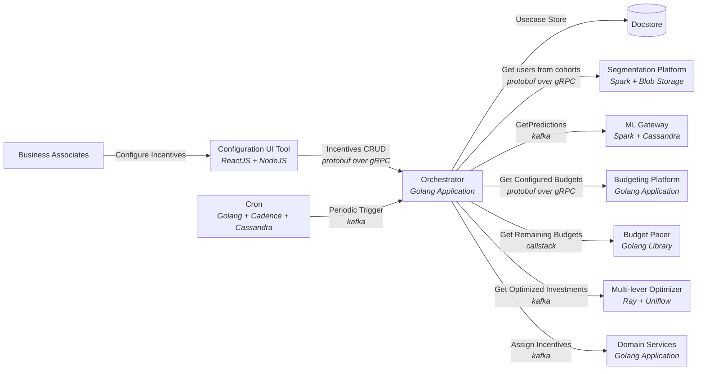
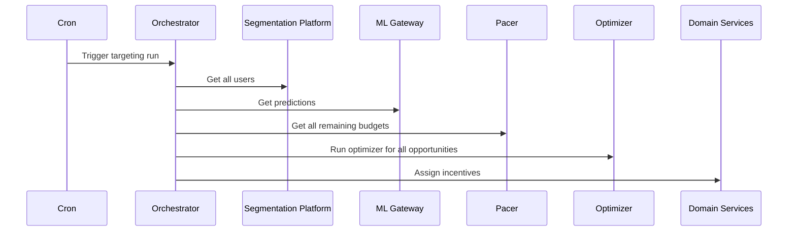

# Uber TAROT Replica

A replica of Uber's **TAROT (TARgeting and Observation Toolkit)** — an incentive targeting and optimization system — built with [encore.dev](https://encore.dev) and Go.

TAROT optimally allocates incentives (promotions, discounts, rewards) to users under budget constraints by modeling the problem as a **Multiple Knapsack Problem**.

## Architecture

### System Overview



### Targeting Run Flow



### Services

| Service | Description |
|---|---|
| `orchestrator` | Central coordinator — triggers and manages targeting runs |
| `segmentation` | Defines and resolves user cohorts |
| `mlgateway` | Serves ML predictions for incentive response |
| `budgeting` | Manages configured budgets per program |
| `pacer` | Tracks remaining budgets and pacing |
| `optimizer` | Solves the multiple knapsack allocation |
| `domain` | Assigns incentives to users |
| `config` | CRUD API for incentive configuration |

## Getting Started

### Prerequisites

- [Go 1.22+](https://go.dev/dl/)
- [Encore CLI](https://encore.dev/docs/go/install) — `brew install encoredev/tap/encore`
- [Docker](https://docker.com) (for local databases)

### Run locally

```bash
encore run
```

Open the local dev dashboard at http://localhost:9400/

### Run tests

```bash
encore test ./...
```

## References

- [TAROT Paper (arXiv)](https://arxiv.org/abs/2407.19078)
- [Solving Multiple Knapsack at Scale (Uber Blog)](https://www.uber.com/br/pt-br/blog/solving-multiple-knapsack/)
- [Encore.dev Go Docs](https://encore.dev/docs/go)
- [Encore Examples](https://github.com/encoredev/examples)
